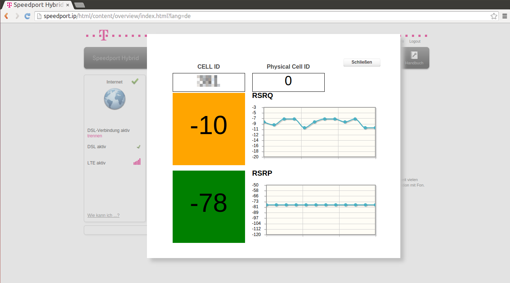
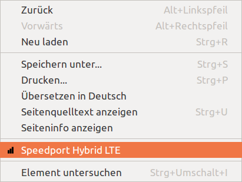

# Speedport Hybrid Chrome-Extension

This Chrome-Extension helps you to show the LTE antenna information. That is
available in the "Hidden" Engineer-Menu.  
The extension refreshes the LTE antenna values every second and shows it in the lightbox.

## Usage
 * First, open your Chrome Browser and install the extension. (perhaps google would be helpful here)
 * Then go to http://speedport.ip and login
 * Via the Context-Menu (right-click), choose "Speedport Hybrid LTE"
 
 
 
 * Have fun

## Firmware
The extension is tested with the following firmware versions:

 * v050124.02.00.009 (5/2015)
 * v050124.01.00.057 (2/2015)
 
## Restrictions
 * No Physical-Cell-Id in Firmware v050124.01.00.057 (2/2015) is shown.
